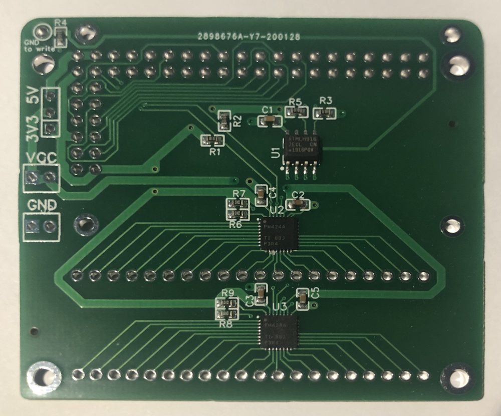
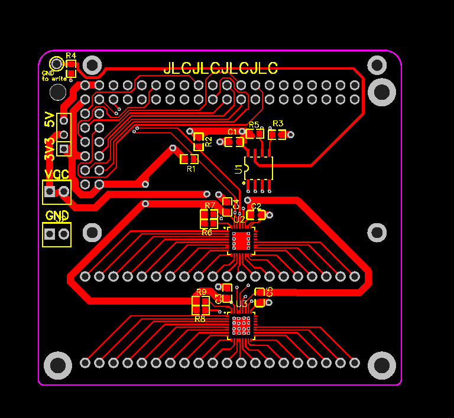
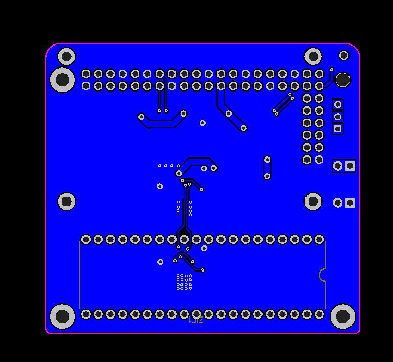

This is my first ever PCB design. It almost certainly does everything wrong (if you're new to PCBs, maybe use some one else as an example)
Comments, feedback, suggestions, etc are all welcomed!
(email me, open a ticket, or send me a pull request).

Design
======

It turns out that the raspberry PI doesn't have that many GPIO pins, and they're all very sensitive, but from what I could find it looks like an I2C GPIO Expander is pretty resilient.
In particular I found the Texas Instruments TCA6424A, which has 24! pins and was level shifting. This allowed me to drive it directly from the raspberry pi's I2C bus, and have the pins at the 5V (and any voltage I wanted).
One catch with the TCA6424A is that it is tiny, and probably not great for hand soldering, but JLCPCB have a reasonably priced assembly service so I figured I'd let them do the tricky soldering.

I also though it would be nice to have a screen, so there's a space for a small SPI touch screen.

Layout
======
I did the layout around a 40-pin ZIF socket and also left space for the touch screen.
The location of the RaspberryPI's pin header and the decision to try and go with the HAT format defined the layout.

In the end the screen didn't quite fit so the board is slightly over-sized anyway.

For placing the components I decided early on that I wanted the sensitive electronics on the top, away from the bottom where I would need to hand solder the ZIF socket. This caution was totally unecessary and meant that the socket doesn't mount flush. (That's good though, since it leaves a space for securing the mounting screws!)

Finally I read somewhere that you should have a ground plane. Since the layout was pretty simple I figured I'd do just that, so most of the under side is a single large ground plane, with a few traces that really couldn't fit on top.

Making the layout
=================
I went through a couple of iterations of making the layout. First in KiCAD (but I had trouble generating the pick and place files), so I re-designed it in EasyIDA so that I could get the Pick and Place files in the correct format (though it was still far from painless!)

I've marked the EasyIDA project as public if you want to play with it.
https://easyeda.com/matthiash_3977/pi-zif40-gpio-with-display
The gerber export (for fabrication) and bom and pick and places files also in this directory.

Closing thoughts
================
I was pretty lucky that this board actually worked first try (surprised even!).
Pretty sure there are lots of design bugs and errors
(was it a mistake to add the massive ground plane?). 

While the board works there's a couple of missing features.
In particular the TCA6424A isn't great for this application as it lacks integrated pull-up/pull-down resistors (making it impossible to detect high-impedenc pins).

If I were to re-do the board I would make it larger to fit a bigger easier to source screen. I'd also ensure that the PI's power supply was on the opposite side to the ZIF socket for easier use. And lastly I'd attempt to use only hand solderable parts (so I can solder it myself, and don't have to fight to generate accurate pick and place files)
