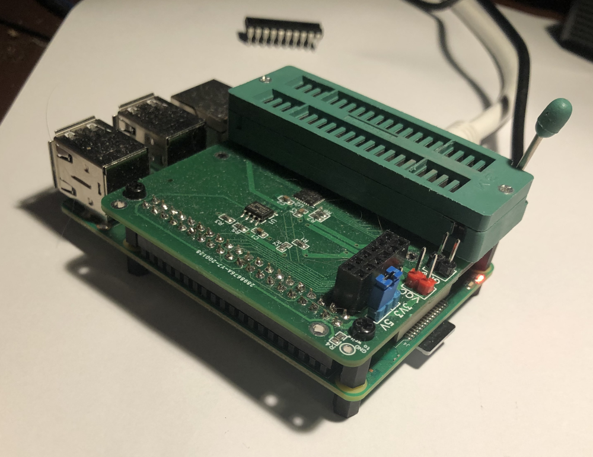
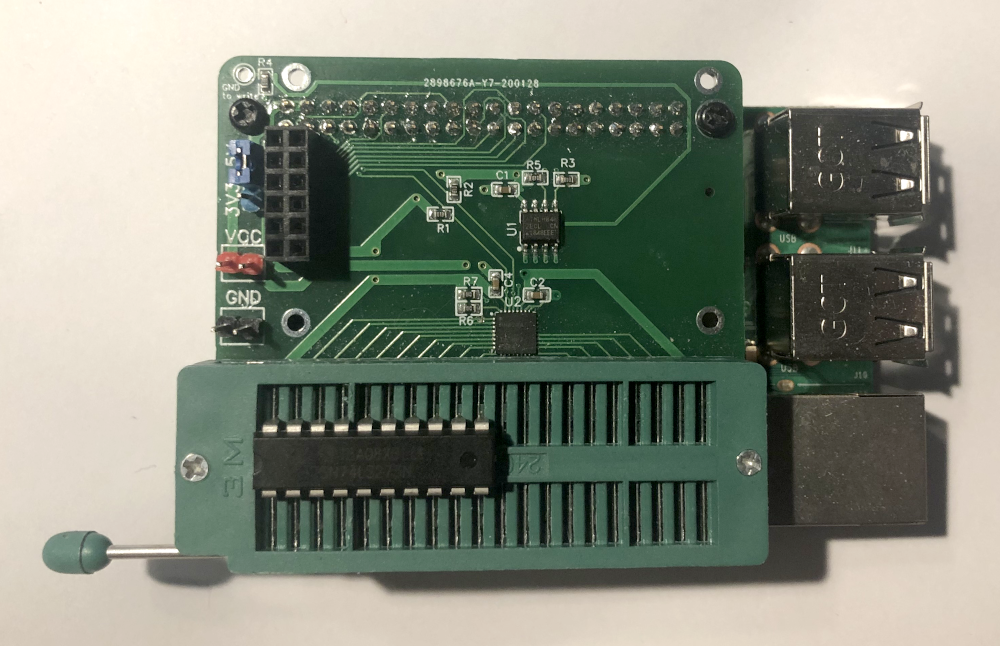

# GPIO-Hat
A hat and software for testing and programming ICs using a raspberry PI.

I recently ordered many 74LSxx series ICs from China and wanted a way to test
the chips to make sure they worked as expected before I put them in my circuits.

This was the result:


And some OCaml programs for driving the whole thing.

# Hardware
Several people made some really neat [arduino](https://blog.arduino.cc/2018/02/05/automated-ic-testing-with-arduino-mega/) [powered](https://hackaday.com/2018/02/15/building-an-arduino-smart-ic-tester-for-25/) [IC](https://www.electronicsforu.com/electronics-projects/hardware-diy/arduino-based-digital-ic-tester-truth-table) [testers](https://blog.arduino.cc/2018/02/05/automated-ic-testing-with-arduino-mega/), but these all seem to be running into the limits of what the platform could do, so I thought why no use a PI, it has WAY more compute power!

So the idea of a PI Hat with a ZIF socket ~~and screen~~ for testing ICs was born.

# Setup
1. Fabricate the HAT and attach it to a Raspberry PI
   I got mine fabricated and part assembled by JLCPCB and then soldered on the headers and ZIF socket.
   (Soldering the TCA6424A is way beyond my non-existing soldering skill).
2. Mount to a raspberry PI (Hopefully you added some mounting screws before soldering the ZIF socket)
3. Ensure that the I2C bus is enabled
   ```bash
   sudo raspi-config nonint do_i2c 0  # yes the flag is inverted!
   # Or use the menu to enable I2C. 
   ```
4. Install OPAM and follow the instructions to setup a simple OCaml environment
   ```bash
   sh <(curl -sL https://raw.githubusercontent.com/ocaml/opam/master/shell/install.sh)
   opam init
   opam install dune core ppx_jane time_now
   ```
5. Get the code
   ```bash
   git clone https://github.com/tiash/gpio-hat
   cd gpio-hat
   git submodule update --init --recursive
   ``` 
6. Build the tools
   ```bash
   dune build --auto-promote
   ```
   
# Usage

## Testing an IC to make it work
1. Make sure you have the voltage jumper set correctly for your ICs (don't want to burn out the IC, or the raspberry pi!)
2. Insert the IC into the socket & pull the leaver to lock the socket in place an make contact.
   Make sure that the IC is in the position furthest from the IO ports, with the Pin 1 mark pointing away
   
3. Run the IC tester tool
   ```bash
   bin/tester.exe test IC_NAME
   ```
   If you have a bunch of ICs of the same type you want to test you can also run
   ```bash
   bin/tester.exe batch-test IC_NAME
   ```
   And press any key to run the test after swapping the ICs
4. If the IC has defects (or you selected the wrong IC_NAME) the tool will report errors
   and print the combination of inputs that triggered the unexpected output.

   You can also add support for more ICs by creating a simulation of the logic
   in [src/ic-tester/models/]. See the existing models in that directory for examples.

## Programming an 16C28 EEPROM
If you're using a different EEPROM you can easily add support to it to the tool.  See [src/eeprom-flasher/eeprom_flasher.ml].
1. Prepare a binary file with the desired EEPROM content
2. Insert the EEPROM in the correct position (furthest from the IO ports with PIN1 furthest away).2. P
3. Run
   ```bash
   bin/flasher.exe 28c16 write -file FILE
   bin/flasher.exe 28c16 check -file FILE
   ```
   This will read the IC, write the changes, and finally read back the ROM to verify the write succeeded.
   Depending on where you sourced your EEPROMs you may find some faulty chips.

   There are also a couple of generators (e.g. `bin/flasher.exe 28c16 {write,check} -seven-segment` will write a 3 seven segment decoder logic)

   
# Things to maybe do someday

## Auto generate truth tables for the ICs
The information is all there, and it would help with making sure the spec
didn't have errors.
This would also allow generating mini data sheets.

## Improve the IC testing monad
Currently the testing works by generating all the possible walk in a semi random way
and then running them.
The randomization is poor (depth first!), change the algorithm to keep track of the choices made
and then do random walks from the start until everything has been reached.

This also eliminates the need for the 'sample' optimization, we can just stop after some number of walks
and assume we have tested sufficiently.

## Even more improvements
Its not clear that keeping the state in the Logic monad is the right thing.
It's very awkward modeling state-full ICs and the random walk isn't really a good simulation.

## Implement auto detection of ICs
The testing programs have enough information to allow auto-detecting the IC that's inserted.

## Finish the hardware inputs
I designed the HAT with a headers for a [small touch screen](https://www.banggood.com/1_8-Inch-LCD-Screen-SPI-Serial-Port-Module-TFT-Color-Display-Touch-Screen-ST7735-p-1414465.html), but never actually hooked it up...

It should be possible to have the screen show a simple UI for selecting the IC, running the tests and showing the results.
 
## Cleanup and improve the design of the HAT Board
The board layout should be changed to put the ICs on the under side, or not underneath the ZIF socket.
There's also lots of features that could make this better.
Here's a few items that come to mind:
- Integrated supply voltage controller instead of the 3.3V/5.0V jumper,
- Use GPIO expander in a larger package that's more suited to hand soldering
- Use more sophisticated GPIO drivers,
  Something with a controllable pull-up/pull-down to detect non driven pins.
  Maybe even use an ADC to detect output voltages
- Improve the response time and allow high speed reading of pins. Something to allow measuring the response time of the IC.
